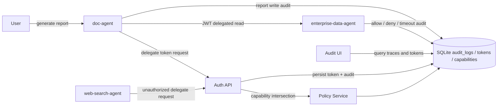

# Agent IAM Architecture

## Goals

- Provide verifiable agent identity with signed access tokens.
- Enforce capability-based authorization across a `User -> Agent A -> Agent B` chain.
- Record every authorization decision for traceability.

## Runtime Modules

- `auth`: issues, introspects, and revokes JWT access tokens.
- `policy`: computes `user permissions ∩ caller agent capabilities ∩ target agent capabilities`.
- `agents`: contains the three demo agents.
- `audit`: stores allow and deny decisions in SQLite.
- `demo`: exposes success, denial, and timeout/degraded paths for judges.
- `ui`: renders a lightweight trace console for recent workflows.

## Architecture Diagram

## Core Flow

1. A user asks `doc-agent` to generate a report.
2. `doc-agent` requests a delegated token for `enterprise-data-agent`.
3. The policy layer computes the effective capability set.
4. If `bitable.read` is allowed, a JWT is signed and persisted.
5. `enterprise-data-agent` validates the token and returns enterprise data.
6. `doc-agent` writes the report and all decisions are saved in audit logs.

## Denial Flow

1. `web-search-agent` requests a delegated token to read enterprise data.
2. The policy layer finds that `web-search-agent` lacks `bitable.read`.
3. Token issuance is denied with `AUTHZ_001`.
4. The denial is stored in `audit_logs`.

## Timeout And Fallback Flow

1. `doc-agent` obtains a valid delegated token for `enterprise-data-agent`.
2. `enterprise-data-agent` validates the JWT, then simulates a downstream timeout.
3. The timeout is written to `audit_logs` with `AGENT_002`.
4. `doc-agent` catches the timeout and returns a degraded report instead of a hard failure.
5. The fallback write is also audited so the full chain remains traceable.

## Dynamic Authorization Flow

1. A caller requests a delegated token with runtime context such as `task_name`, `purpose`, and `current_hour`.
2. The policy layer evaluates user, caller-agent, and target-agent capability rows together.
3. Conditions in `conditions_json` are enforced in addition to base capability matching:
   - audience restrictions
   - allowed task names
   - allowed request-hour window
4. If any side of the intersection fails the context check, delegation is denied and the audit log explains why.

## Unavailable Agent Flow

1. `doc-agent` obtains a valid delegated token for `enterprise-data-agent`.
2. `enterprise-data-agent` simulates immediate service unavailability.
3. The downstream failure is written with `AGENT_001`.
4. `doc-agent` aborts report generation and records its own failure decision.
5. The demo API surfaces the error as HTTP `503`.

## Token Fields

- `iss`: issuer, fixed to `agent-iam`
- `sub`: caller agent identifier
- `aud`: target agent identifier
- `iat`: issue time
- `exp`: expiration time
- `jti`: token identifier
- `trace_id`: end-to-end workflow identifier
- `parent_jti`: parent token identifier if a chain expands
- `delegated_user`: original user context
- `capabilities`: effective capabilities granted to this token
- `task`: task name and requested action
  - also carries runtime context such as `purpose` and `current_hour`
- `delegation`: caller and target agent pair

## Audit Fields

- `request_id`
- `trace_id`
- `token_jti`
- `parent_jti`
- `caller_agent`
- `target_agent`
- `delegated_user`
- `resource`
- `action`
- `decision`
- `reason_code`
- `reason_detail`
- `created_at`

## Design Notes

- Static authorization comes from seeded capability rows for users and agents.
- Dynamic authorization is the runtime intersection:
  `user permissions ∩ caller capabilities ∩ target capabilities`.
- Runtime conditions are evaluated from `conditions_json` on capability rows, not from hard-coded route logic.
- Trust-chain context is preserved with `trace_id`, `jti`, and `parent_jti`.
- The demo UI intentionally reads from persisted audit and token records rather than in-memory state.
